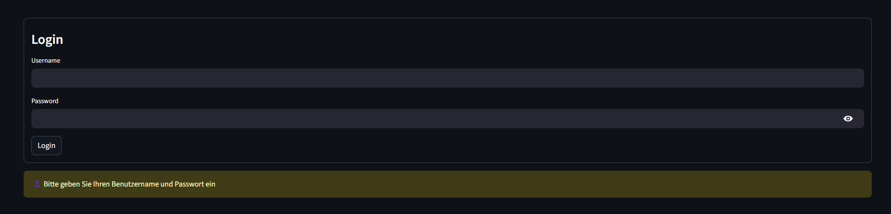
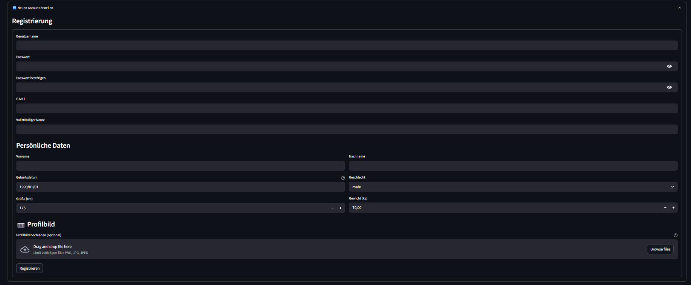
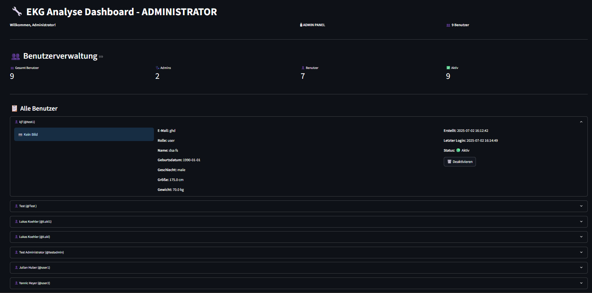
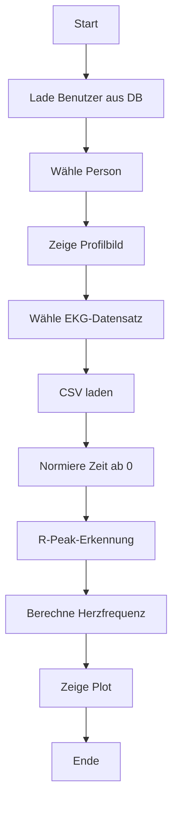

# ❤️‍🔥 EKG App – Analyse & Visualisierung von Trainings- und EKG-Daten

## 🧾 Übersicht

Die **EKG App** dient der intuitiven Visualisierung und Analyse von Sport- und EKG-Daten einzelner Benutzer. Sie bietet:

- 🔐 Benutzer-Login mit Profilbild, Registrierung & Rollen (User/Admin)  
- 🫀 Verwaltung & Anzeige von EKG-Testdaten mit Peak-Erkennung (EKG testdaten können nur vom Admin hochgeladen werden, und User können nur eigene EKG tests analysieren)
- 🏃‍♂️ Import & Auswertung von Trainingsdaten aus `.fit`-Dateien  
- 👩‍⚕️ Admin-Funktionen zur Benutzerverwaltung  
- 📈 Visualisierung von Herzfrequenz, Geschwindigkeit, Leistung, etc.

Automatisch berechnete Kennwerte:

- 💓 Durchschnittliche & maximale Herzfrequenz  
- 🚴 Durchschnittliche & maximale Leistung, Geschwindigkeit, Trittfrequenz  
- 🕐 Trainingsdauer & Distanz  
- 🌡️ Temperatur- & Höhenverläufe

---

## 🚀 App starten

### 🔧 Voraussetzungen

- 🐍 Python ≥ 3.8  
- 📦 Paketmanager [PDM](https://pdm.fming.dev/)  
- 📄 Abhängigkeiten laut `pyproject.toml`

### ▶️ Schritt-für-Schritt-Anleitung

1. Repository klonen:
   ```bash
   git clone https://github.com/KRSI58/programmieruebung_2-5.git`
    ```
    ```bash
   cd programmieruebung_2_abschlussprojekt
   ```
2. Projekt initialisieren:
    ```bash
    pdm install
    ```

3. App starten:
    ```bash
    pdm run streamlit run main.py
    ```
### 🖼️ APP Screenshot – Login

### 🖼️ APP Screenshot – Benutzer erstellen

### 🖼️ APP Screenshot – Benutzer löschen (Admin Funktion)

### 🖼️ APP Screenshot – EKG Analyse
[EKG & Sports Analyse Dashboard.pdf](https://github.com/user-attachments/files/21023445/EKG.Sports.Analyse.Dashboard.pdf)

### 🖼️ APP Screenshot – Trainings
[EKG & Sports Analyse Dashboard2.pdf](https://github.com/user-attachments/files/21023461/EKG.Sports.Analyse.Dashboard2.pdf)

### 🗂️ Projektstruktur
| 📁 Datei/Ordner         | 📝 Beschreibung                                                       |
| ----------------------- | --------------------------------------------------------------------- |
| `data/`                 | Übergeordneter Ordner für alle Daten                                  |
| `data/ekg_data/`        | EKG-Rohdaten der Trainingssessions                                    |
| `data/sports_data/`     | `.fit`-Trainingsdaten (Radfahren, Laufen etc.)                        |
| `data/pictures/`        | Profilbilder der Benutzer                                             |
| `data/person_db.json`   | JSON-Datei mit Testpersonen + EKG-Tests                               |
| `personen.db`           | SQLite-Datenbank für Benutzer & Tests                                 |
| `main.py`               | Einstiegspunkt der App (Streamlit)                                    |
| `ekg_data.py`           | Klasse zum Laden, Bearbeiten & Plotten von EKG-Daten                  |
| `sport_data.py`         | Funktionen zum Einlesen & Auswerten von `.fit`-Dateien                |
| `person.py`             | Klasse für Personenverwaltung aus JSON oder Datenbank                 |
| `database_auth.py`      | Authentifizierung, Registrierung & Benutzerverwaltung mit Bildsupport |
| `json_to_sql.py`        | JSON-Datenimport in die SQLite-Datenbank                              |
| `fix_db.py`, `debug.py` | Tools zur Fehlerbehebung und Passwortreset                            |
| `test_fit_load.py`      | Testscript zum Laden der FIT-Daten                                    |
| `test_import.py`        | Testscript zum Validieren des JSON-Imports                            |
| `pyproject.toml`        | Projektdefinition für PDM                                             |
| `pdm.lock`              | Lock-Datei mit aufgelösten Abhängigkeiten                             |

### 🔄 Ablaufdiagramm – EKG Datenverarbeitung



### ℹ️ Hinweise
- Admin-Login: admin / admin123
- Benutzer1 (Julian Huber): User1 / password123

- Standard-Passwörter können mit reset_passwords.py neu gesetzt werden

- EKG-Daten müssen als .csv oder .txt mit zwei Spalten (mV, ms) vorliegen, und in data/activity_data gespeichert sein

- .fit-Dateien müssen in data/sports_data/ gespeichert sein
